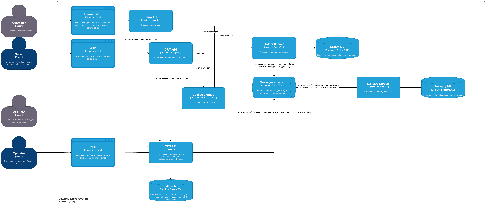

# Что нужно сделать
На этом этапе вам нужно проанализировать архитектуру, выявить проблемы и предложить решения.

1. Создайте в директории Task1 текстовый файл и назовите его «Планирование: анализ, идентификация проблем и поиск решений». Работайте над заданием в этом файле.
2. Проанализируйте схему и описание системы. Идентифицируйте существующие и потенциальные проблемные места. Напишите их список.
3. Разработайте инициативы, которые необходимы для устранения нежелательных ситуаций. Запишите их в список.
4. Расставьте инициативы в порядке приоритета. Опишите ход своих рассуждений и ответьте на вопросы:
    - Какой вы видите целевую архитектуру через полгода?
    - Если бы у вас была возможность выполнить только три пункта из списка инициатив в ближайшие полгода, что бы вы выбрали и почему? Не обязательно добавлять в список только эпики. Вы можете включить в план как крупные изменения, так и локальные задачи.

# Размышления

Найм дополнительного QA с умением писать автотесты - 1 QA на четырех разработчиков по статистике маловато и у него может быть перегруз. Сейчас автотестов судя по описанию либо нет, либо мало, что удлиняет время проверки фичей. 

Не очень ясно кто занимается аналитикой. Сейчас это делает либо продакт, либо тимлид, либо разработчики. Отдельной должности в описании не прописано. Должен быть человек, который преобразует бизнес требования в технические. 

Задача продакта - формировать гипотезы и проверять их.
Задача тимлида - управлять процессами команды и постепенно улучшать lead time.

Стоит выделить роль аналитика, который будет звеном между продактом и разработчиками.

Есть проблема со временем исправления багов - либо поток задач слишком велик, либо баги сложно отловить. Требуется уточнение.

Поток задач можно ограничить work limit'ом на Kanban доске.
Обнаружение багов решается правильным выделение доменных областей для снижения зависимостей, написанием тестов и реализацией observability.

На архитектурной схеме явно заметен антипаттерн shared database, что я бы исключил, поскольку это усложняет поиск багов и упрощает допущение архитектурных ошибок в будущем. 

Интернет магазин участвует в создании заказа и имеет свои статусы, но доступа к брокеру сообщений для обмена информацией по статусам не имеет. 

Есть проблема с перекосом знания стеков технологий - React знает всего один человек, причем частично, а C# знает один бекендер. Тогда как Java знают два разработчика и два инженера знают Vue. 

Желательно переводить всех на стек Java + Vue. Переписывать продукт вероятно будет дорого, поэтому нужно новый функционал реализовывать на целевых стеках, а в MES делать минимум доработок. 

Плюс нет почему то статуса отмены заказа - неясно как решаются такие случаи, они точно должны существовать. Например загруженную модель невозможно произвести или если клиент передумал, а в разработку еще не передали или например заказ не смогли доставить.

Какие бизнес процессы существуют в компании исходя из описания:
- Оценка заказа
- Загрузка своей модели для заказа
- Конструирование модели ювелирного изделия в редакторе
- Создание заказа
- Проверка корректности заказа
- Передача заказа в работу (создание юв. изделия)
- Упаковка заказа
- Отправка заказа
- Закрытие заказа после успешного вручения

Основной домен это Конструирование ювелирного изделия. 

Поддерживающий домен
- Оценка стоимости работ
- Доставка изделия клиенту
- Создание ювелирных изделий

Сущности
- Заказ
- Трехмерная модель
- Адрес доставки
- Оценка работ
- Задание на создание заказа
- Задание на доставку

Заказ может быть создан в двух местах - в CRM от сторонних компаний и Интернет магазине от физических лиц. 
Следует выделить работу с заказами в отдельный сервис, а детали работы со сторонними компаниям оставить в CRM API и детали работы с клиентами в Shops API.

Работы с сервисами доставки на схеме тоже нет, отражу как отдельный сервис.

# Симптомы проблем

1. Потери заказов: 
    - Клиенты жалуются менеджерам по продажам, что они не получили заказ и над их изделием работают уже несколько месяцев, хотя обещали закончить за три недели.
    - При создании заказов через CRM потери увеличились с увеличением нагрузки.
2. Долгая загрузка первой страницы MES: Долгая загрузка актуальных заказов по фильтрам. Пагинация и фильтрация не помогли решить проблему.
3. Задержки при релизе до месяца и более - релиз блокируется при нахождении проблем уровня high и highest тестировщиком

# Выделенные проблемы 
- 1 QA на 4 разработчиков
- Нет явного ответственного за технические требования - отсутствие аналитика
- Антипаттерн shared database
- Отсутствие статуса отмены заказа
- Редкие стеки среди сотрудников React и C#
- Нет полноценного автотестирования
- Проблема с долгим исправлением найденных багов - потенциально проблемы с ограничением активных задач или сложность обнаружения ошибок
- Проблема с нагрузкой на БД - потенциально проблемы с оптимизацией или распределением нагрузки

# Целевая архитектура через полгода

В этой архитектуре предлагается выделить в отдельный сервис управление заказами. 
Таким образом shops api и crm api будут работать только со своей спецификой, а orders service управлять жизненным циклом заказов предоставляя информацию о статусах заказов и инициируя запрос на выполнение работы или доставки. 

MES API будет работать только как оценщик заказов для CRM API и Shops API и будет работать с новой сущность задание на работу, с которым уже будут работать операторы.

В рамках новой архитектуры также предлагается для каждой PostgreSQL добавить синхронную и асинхронную реплики. Это позволит при падении мастера быстро переключиться на синхронную реплику, а часть чтений переключить на асинхронную. 

Внешний кеш в виде Redis для сервиса MES пока было решено не вводить, поскольку 
- предрасчитанные значения по трехмерным моделям можно хранить в базе данных, а пересечений не ожидаается слишком много, что даст много miss'ов
- Данные по новым заказам являются часто изменяемыми и не подходят для кеширования.

# Инициативы
Следующими бы действиями я выбрал исходя из срочности. Наиболее срочными проблемами сейчас является утеря заказов и медленная загрузка заказов. 

Эти проблемы можно решить следующими инициативами:
- Найм QA разработчика, умеющего в автотесты. Это поможет быстрее находить проблемы до ручного тестирования.
- Миграция на новую архитектуру - уменьшит количество неявных проблем с управлениями заказами из-за четкого распределения ответственности и добавит стабильности БД PostgreSQL
- Повышение observability: Если разработчики ограничены в понимании источника проблем, то настройка логов и трейсов поможет упростить эту задачу.