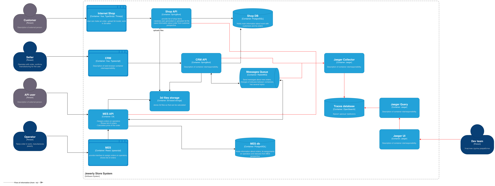
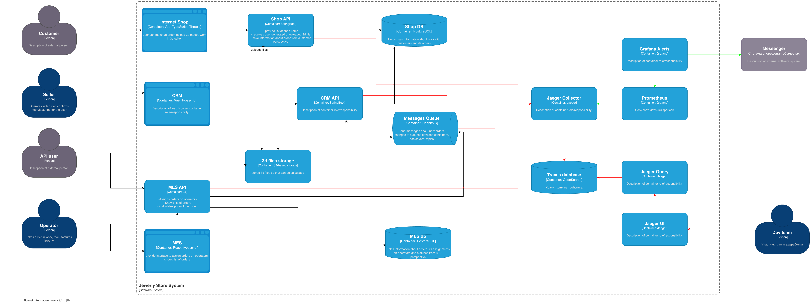
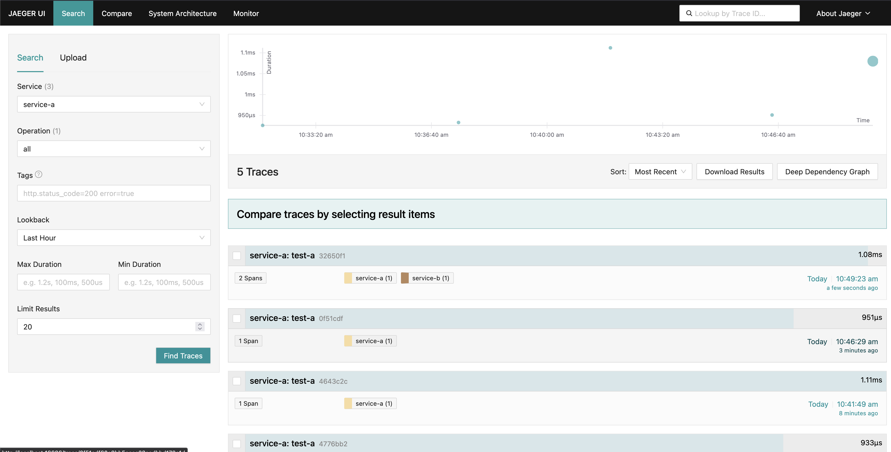
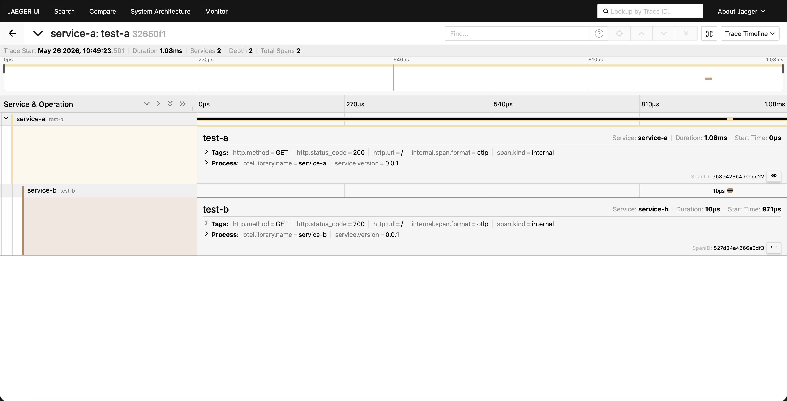

# Задание 3. Трейсинг

Команда видит, что заказы часто находятся в непонятном состоянии или зависают на каком-то сервисе внутри IT-ландшафта. Проблемы с заказами могут появляться и вовсе только потому, что сообщения теряются.

Вам необходимо внедрить инструмент, с помощью которого команда сможет увидеть, что происходило с заказом и где он находится сейчас.

### Что нужно сделать

1. **Создайте в директории Task3 текстовый файл «Архитектурное решение по трейсингу».** В нём вы будете работать над заданием
2. **Проанализируйте систему компании и C4-диаграмму в контексте планирования трейсинга.** Напишите и выделите на схеме системы, которые следует покрыть трейсингом. Для этого идентифицируйте места, где заказ может «сломаться» или зависнуть.
    
    Составьте список данных, которые должны попадать в трейсинг.
    
3. **Добавьте в документ раздел «Мотивация».** Напишите здесь, почему в систему нужно добавить трейсинг и что это даст компании. Опишите возможные три-пять технические и бизнес-метрики решения, на которые повлияет внедрение трейсинга.
4. **Добавьте раздел «Предлагаемое решение».** Опишите, как и с помощью каких технологий будет реализован трейсинг, какие компоненты нужно внедрить или доработать. Отразите компоненты и новые связи на схеме. Скачайте [диаграмму контейнеров](https://code.s3.yandex.net/software-architect/jewerly_c4_model.drawio?etag=3fd9b7afd2890dfd40ae2217e418e9fa) «Александрита» в модели C4. Доработайте диаграмму, исходя из вашего решения: отразите на ней новые компоненты и связи. Новые элементы выделяйте красным цветом — так ревьюеру будет проще проверить вашу работу. Когда схема будет готова, добавьте ссылку на неё в раздел «Предлагаемое решение».
5. **Добавьте раздел «Компромиссы».** Опишите, в каких случаях трейсинг не принесёт пользы или пока невозможен, или его реализация обойдётся слишком дорого.
    
    Например, сложно заставить проприетарную систему отдавать метрики в нужном формате, может потребоваться дорогостоящая доработка.
    
6. **Проработайте аспекты безопасности.** Опишите, какие меры для предотвращения несанкционированного доступа будут предусмотрены для системы трейсинга внутри компании и снаружи если это требуется.
    
    Например: «Внедрение аутентификации — зайти в систему смогут только сотрудники компании с актуальной учетной записью и ролью “Поддержка”».
    
7. **Дополнительное задание.** Спроектируйте и опишите в разделе «Предлагаемое решение», как будет реализованы автоматический мониторинг процесса прохождения заказа, полученные из данных трейсинга, и алертинг. Обновите последний вариант диаграммы, который вы подготовили для этого раздела, — отразите на нём необходимые связи. Новые элементы выделяйте зелёным цветом. Добавьте отдельную ссылку на новый вариант диаграммы.
    
# Решение

## Места покрытия
Исходя из текста задания, заказ создается, и в клиентском интерфейсе показывается как созданный, но видимо потом он где-то теряется. Значит, вероятно, заказ успешно добавляется в ShopDB, потом в CRM API или MES API, он может некорректно обрабатываться, либо заказ может удаляться по истечению времени в Message Broker.

Значит каждый сервис необходимо покрыть трейсингом. Также RabbitMQ поддерживает трейсинг через AMQP-заголовки, поэтому можно будет явно увидеть где остановилась обработка заказа. 

В трейсах нужно фиксировать:
- номер заказа
- каждую ошибку, которая встречается в системе
- входные параметры методов

## Мотивация 

Трейсинг повлияет на следующие метрики:
- Время обнаружения причин бага
- Количество зависших заказов
- Количество жалоб от клиентов
- Среднее время выполнения заказа
- Потери от технических проблем

## Предлагаемое решение

Спроектируйте и опишите в разделе «Предлагаемое решение», как будет реализованы автоматический мониторинг процесса прохождения заказа, полученные из данных трейсинга, и алертинг. Обновите последний вариант диаграммы, который вы подготовили для этого раздела, — отразите на нём необходимые связи. Новые элементы выделяйте зелёным цветом. Добавьте отдельную ссылку на новый вариант диаграммы.
---

Трейсинг будет реализован с помощью Jaeger и OpenTelemetry SDK.

Для этого понадобиться добавить:
- Collector
- Query
- Jaeger UI
- OpenSearch как поддерживаемую базу для primary трейсов

Collector, Query и Jaeger UI можно поднять через jaeger-all-in-one решение. В будущем можно будет разделить, если потребуется масштабирование.  

Позже можно будет добавить Badger для archive трейсов, если потребуется.



---

Для того, чтобы реализовать автоматический мониторинг процесса прохождения заказа на основе данных из трейсинга необходимо добавить сюда Grafana Alerting, который поддерживает trace-based alerts. 

Prometheus будет собирать метрики Jaeger Collector, далее Prometheus подключается как источник в Grafana Alerts, который будет посылать данные в необходимый мессенджер.

Для настройки таких алертов нужно настроить алерты на ошибки на этапах смены статуса.
Например:
- не проходит этап payment_confirmed -> production_started
- выросло количество ошибок при публикации сообщений в RabbitMQ




## Компромиссы

Для фронтенда, баз данных и для s3 хранилища внедрение трейсов не принесет пользы. Метрики работы с ними можно получить другим образом и внутренние детали проприетарных систем нам недоступны. А детали трейсов с фронта до бека не интересны в том плане, что если запрос не дойдет, то и заказ не будет создан. Для клиента можно предусмотреть визуальное отображение ошибки. 

## Аспекты безопасности

Для предотвращения несанкионированного доступа в систему трейсинга будет предусмотрен доступ к системе только из корпоративного впн и после SSO авторизации (например, через Authentik). Доступ к системе будет только у команды разработки. 

# Задание 3.1. Трейсинг с OpenTelemetry и Jaeger

Команда, помимо реализации быстрых улучшений планирует реализовать разворачивание сервисов в Kubernetes, что позволит оптимальней реагировать на нагрузку в будущем. Поэтому необходимо собрать MVP c несколькими сервисами и трассировкой.

В [репозитории](https://github.com/Yandex-Practicum/architecture-alexandrite-k8s-trace) находятся подготовленные DevOps специалистом конфигурации для запуска Jaeger в папке k8s.

### Что нужно сделать

В файле README.md описаны необходимые шаги для запуска:

Скопируйте конфигурации к себе в репозиторий Task3.

2. Разработайте два сервиса, например сервис расчёта и сервис заказов на любом языке программирования.
    
3. У каждого сервиса должно быть по одному REST API методу, например GET.
    
4. Добавьте работу с OpenTelemetry SDK в свои сервисы, чтобы при вызове первого сервиса он вызывал второй, и этот вызов целиком попадал в один трейс.
    
5. Сделайте вызов, например так:
    

```
# Вызов service-a, который вызывает service-b

kubectl exec -it $(kubectl get pods -l app=service-a -o jsonpath='{.items\[0\].metadata.name}') -- wget -qO- http://service-a:8080 
```

6. Откройте Jaeger UI:

```

kubectl port-forward svc/simplest-query 16686:16686 
```

Откройте в браузере: [http://localhost:16686](http://localhost:16686).

Найдите свой трейс и сделайте скриншот.

7. Добавьте скриншот в папку с третьим заданием.


