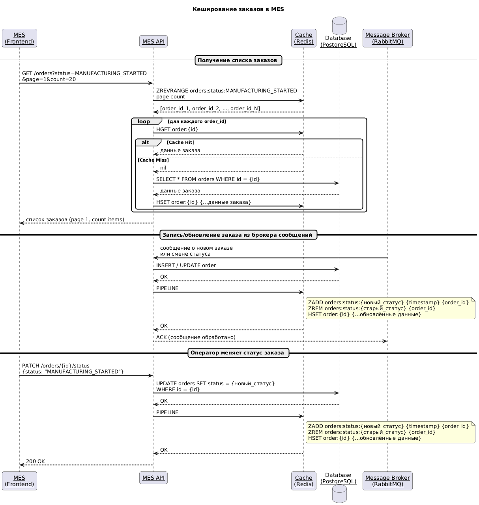

# Задание 5. Кеширование

Итак, MES чувствует себя не очень хорошо. Операторы жалуются на низкую скорость работы со страницей, а новых клиентов не устраивает скорость выполнения заказа. Руководство «Александрита» просит вас разобраться с проблемой.

Вам нужно подготовить документ с описанием вашего архитектурного решения. Он поможет вам объяснить бизнесу и разработчикам, что нужно сделать, чтобы решить проблему.

В процессе разработки команда будет использовать артефакт как справочный документ. К таким документам удобно обращаться, если нужно понять, почему было принято то или иное решение.

### Что нужно сделать

1. **Создайте в папке Task5 текстовый файл «Архитектурное решение по кешированию».** Здесь вы будете работать над заданием.
2. **Проанализируйте диаграмму системы и её описание.** Решите, какую часть системы имеет смысл закешировать.
3. **Добавьте в файл раздел «Мотивация».** Опишите здесь, почему вы предлагаете внедрить кеширование, какие проблемы оно должно решить и какие элементы системы вы планируете включить в кеширование.
4. **Добавьте раздел «Предлагаемое решение».** Определите, какое кеширование вы будете внедрять — клиентское или серверное. Объясните, почему, на ваш взгляд, нужно использовать именно его. Если вы решите куда-то внедрить серверное кеширование, то поясните, какой паттерн будете применять — Cache-Aside, Write-Through или Refresh-Ahead. А также объясните, почему вы выбрали этот паттерн и почему остальные паттерны не подойдут или покажут себя хуже.
5. **Нарисуйте [диаграмму последовательности действий (Sequence diagram)](https://ru.wikipedia.org/wiki/Диаграмма_последовательности).** Отобразите там, как проходит операция чтения списка заказов и запись об изменении статуса заказа. Там же опишите процесс кеширования с указанием всех сущностей, которые участвуют в кешировании. Добавьте диаграмму в раздел «Предлагаемое решение».
6. **В блоке «Предлагаемое решение» опишите стратегию инвалидации кеша, которую вы планируете использовать.** Объясните, какую стратегию инвалидации вы предлагаете (временную, по ключу, программную или другие), почему она подойдёт и почему не подойдут другие стратегии. Не всегда очевидно, какое решение лучше. Чтобы выбрать оптимальный вариант, можете сделать сравнительный анализ в виде таблицы. Например, так:
    
|Первая стратегия|Вторая стратегия|Остальные стратегии|
|---|---|---|
|Лучше подходит, потому что...   Есть особенности: 1)… 2)…|Позволяет сделать…   Не позволяет сделать...|…|
    
7. **Дополнительное задание.** Если вы считаете, что может быть несколько решений и вам сложно выбрать между ними, можете описать несколько вариантов. В таком случае в разделе «Предлагаемое решение» запишите как минимум два решения и подготовьте сопоставление в виде таблицы. Например, так:

| |Решение 1|Решение 2|
|---|---|---|
|Описание решения и его диаграмма|||
|Плюсы решения|||
|Минусы решения|||

После таблицы сделайте заключение. Опишите, какое решение, на ваш взгляд, подходит больше и почему.

# Решение

## Мотивация
Стоит закешировать обращения MES API к MES db - вероятно актуальные состояния заказов, т.к. именно они показываются на главной странице и самые важные по своей сути.

Следует закешировать расчет стоимости (расчёт стоимости занимает 2–30 минут) по ключу sha256 от файла модели и рассмотреть возможность кеширования статусов заказов. 

Помимо этого обращения у сервиса есть обращения в брокер сообщений и в 3d models storage. Их кешировать нет смысла, поскольку в брокере сообщений всегда новая информация. Для трехмерных моделей кеш не преназначен и большого смысла хранить их нет, поскольку можно хранить результат расчета на их основе. 

Кеширование должно уменьшить время ответа сервиса и снизить нагрузку на базу данных. 

## Предлагаемое решение
В части работы с заказами не упоминается работа с долгохранимыми данными, потому кеширование на стороне клиента я бы если и делал, то только на время сессии, чтобы сгладить временные недоступности сервиса. 
Работа с заказами будет доступна, только для тех, которые уже в работе у оператора и отправлять актуальный статус после возобновления связи. 

Серверное решение будет более предпочтительно вводить, посколько актуальные заказы могут часто обновлятся и информация есть только у сервиса. 

### Детали реализации кеширования

Для кеширования расчета стоимости можно выбрать самый простой вариант:
Инвалидация по времени(модель не меняется при фиксированном sha256) и кеширование через cache aside. Если расчета нет, то запускаем его и пишем в кеш.
Предрасчитанные значения дополнительно будут храниться в бд. 
Дополнительно можно инвалидировать кещ вручную если меняются правила расчета, но это должен быть редкий кейс и может быть выполнен администратором. 

Write-Through не подходит — можно использовать, но старые записи кешироваться не будут и если вдруг они опять понадобятся, то запрос будет дольше.
Read-Through не подходит — кеш не может сам инициировать расчёт модели, это сложная бизнес-операция.
Refresh-Ahead не подходит — невозможно предсказать, какие модели будут запрошены повторно, а хранить все - дорого.

Для кеширования заказов: 

Я бы выбрал смесь write-through и read-through на уровне приложения - Читаем из кеша, если нет, то из базы, а добавление новых сущностей при записи. Инвалидацию осуществлять по ключу. 
Для каждого статуса по заказам будет храниться свой список заказов через Redis Sorted Set.
Инвалидация по времени не применима для всего списка, но должна выполнятся для данных заказа, чтобы хранились только актуалньные заказы. 

Cache aside - не очень подходящий вариант, поскольку не связи с обновлением в базе данных и можно легко получить неконсистентность данных. 

Write-Behind - я бы не стал применять поскольку самые актуальные данные будут в кеше, а данные чувствительные для бизнеса и потеря таких данных будет стоить денег. 

Refresh-ahead - может скрывать ошибки и маскировать неконсистентность данных между временем обновления. Если заказов слишком много, то полное сканирвоание базы данных для обновления может создавать значительную нагрузку. 

Read-through - требуется поддерживать пагинацию, фильтры и иметь такую же схему как в бд. Сложно в реализации

### Диаграмма взаимодействия

Получение списка заказов

MES - MES API - Cache - Database

1. получаем список из count заказов - ZREVRANGE orders:status:MANUFACTURING_STARTED  page count - 
2. Для каждого ID → HGET order:{id}
   - cache hit: берём из Redis
   - cache miss: идём в БД только за этим заказом, пишем в кеш
3. Возвращаем ответ

Запись заказов из брокера сообщений

Message Broker - MES API - Cache - Database

1. Получаем сообщение 
2. Записываем в бд
3. Обновляем данные в кеше через пайплайн
    - Добавляем в список по статусу - ZADD orders:status:{новый_статус} {timestamp} {order_id}
    - Удаляем по старом статусу - ZREM orders:status:{старый_статус} {order_id}
    - Обновляем данные по заказу HSET order:{id} {...обновлённые данные}
4. Возвращаем ответ, если все ок 

MES - MES API - Cache - Database

1. Получаем сообщение 
2. Записываем в бд
3. Обновляем данные в кеше через пайплайн
    - Добавляем в список по статусу - ZADD orders:status:{новый_статус} {timestamp} {order_id}
    - Удаляем по старом статусу - ZREM orders:status:{старый_статус} {order_id}
    - Обновляем данные по заказу HSET order:{id} {...обновлённые данные}
4. Возвращаем ответ, если все ок 

